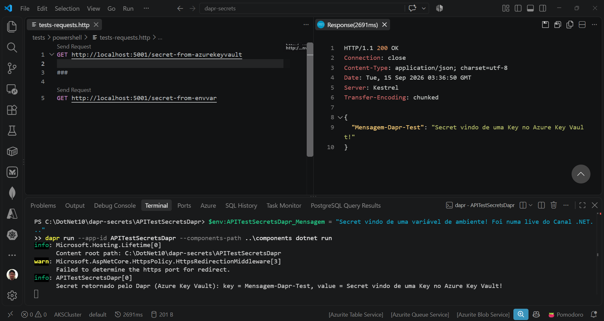
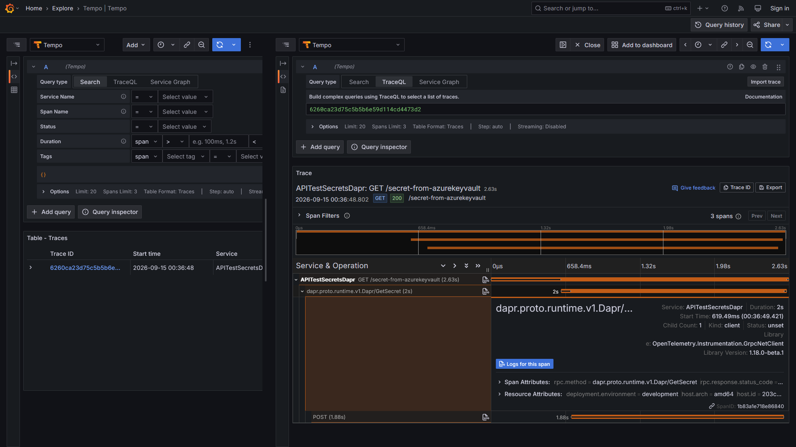
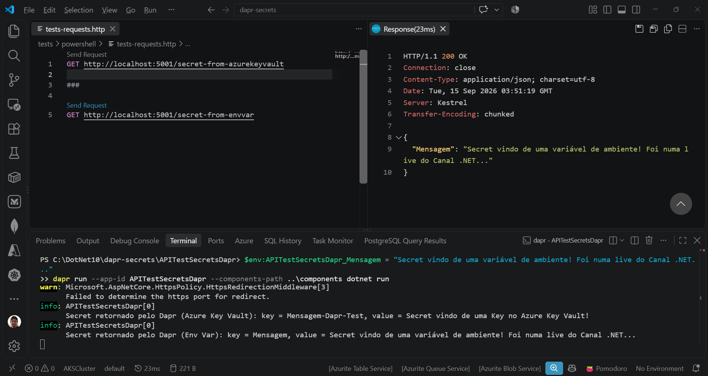
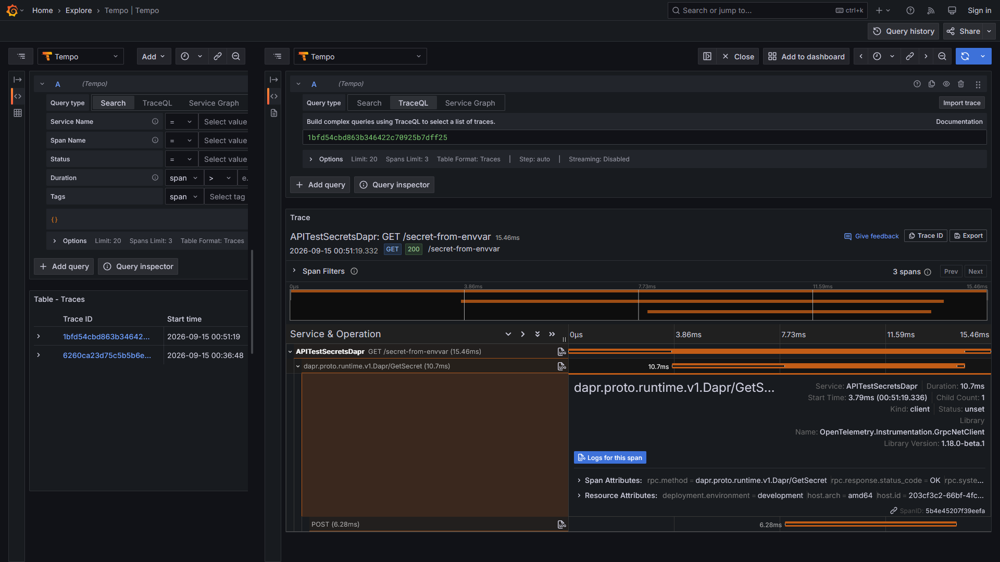

# aspnetcore10-dapr-secretstores-envvar-azurekeyvault-otel-grafana-tempo
Exemplo de implementação do uso de Secret Stores com Dapr em uma API REST criada com ASP.NET Core + .NET 10. Inclui uso de traces coletados com OpenTelemetry + Grafana Tempo, com a criação de um ambiente de testes via Docker Compose.

Secrets management overview - Dapr Docs: **https://docs.dapr.io/developing-applications/building-blocks/secrets/secrets-overview/**

## Testes

Teste utilizando o secret store do Dapr que se baseia em Azure Key Vault:

Trace no Grafana Tempo envolvendo o uso do secret store do Dapr que se baseia em Azure Key Vault (via chamada gRPC):

Teste utilizando o secret store do Dapr que se baseia em variáveis de ambiente:

Trace no Grafana Tempo envolvendo o uso do secret store do Dapr que se baseia em variáveis de ambiente (via chamada gRPC):

